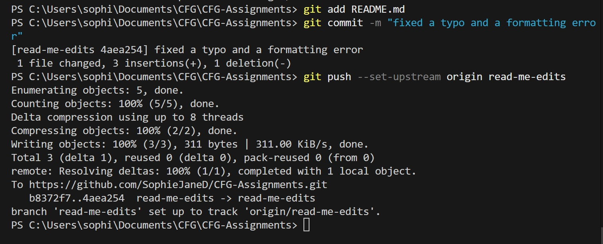

# CFG-Assignments

# Assignment 1

## <ins> About Me </ins>

**Name:** Sophie Dornan

**Age:** 30

**Favorite programming language:** Javascript

## <ins> Previous Studies </ins>

I haven't completed any previous CGF projects, however I studied a few modules with Open University and some key projects I worked on there are as follows:

 - Battleships Game
 - Drawing and animating polygons
 - Student number database

 During my *brief* studies I've learned that in coding it's about <ins> resilience and problem solving </ins> when things don't work (and practice, practice, practice).

## <ins> Github and Assignment 1 </ins>

 In this assignment I will be using Github to upload my project for my tutor, Frederick to mark.

# Picture 1

Checking status and creating a branch

# Picture 2

Adding a file to a branch and adding a commit with a meaningful message

# Git Ignore

A .gitignore file dictates which files or directories it should ignore and not track. This has a few applications:

- Hiding sensitive or private information

- Excluding large or irrelevant files

# Requirements.txt file

A requirements.txt file is used to list the dependencies, external libraries and packages, that the project needs to run. This file allows easy sharing of project requirements and ensures users or other prgrammers can set up the same environment.

# Opening a pull request and Merging and deploying to main branch

I am unsure how to evidence this part as it is the final step when finalizing my work for submission. I start by pushing my work to the repository. When I open pull requests on Github I find there are changes avaialble to merge.  I add a title and a description of the changes I have made.  I can compare the changes to merge the branches and when I am in the pull request I see that the branches are ableto be automatically merged.  
